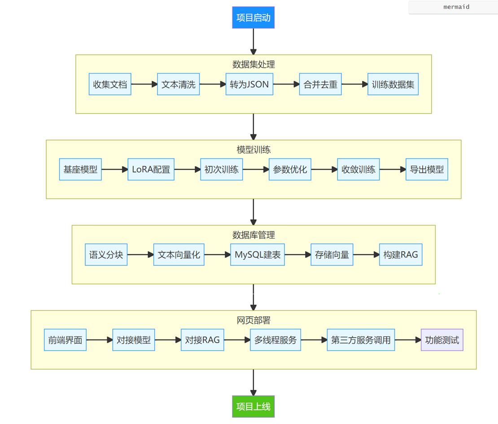
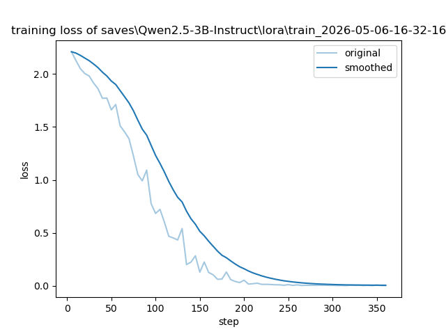
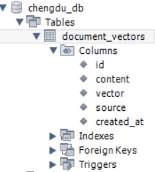
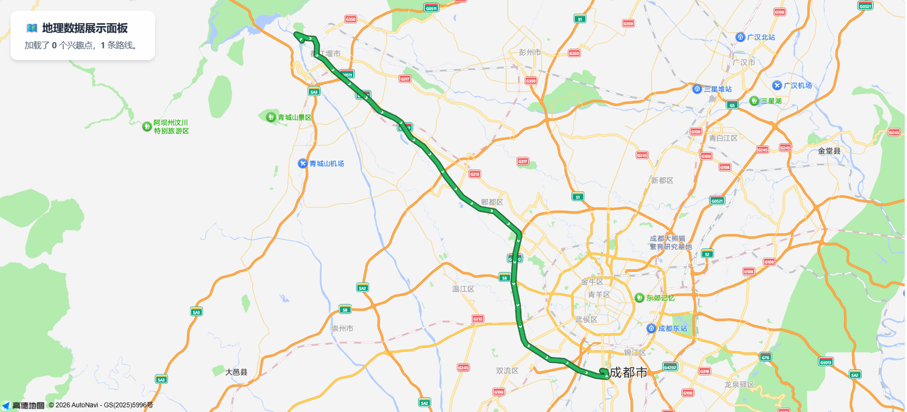
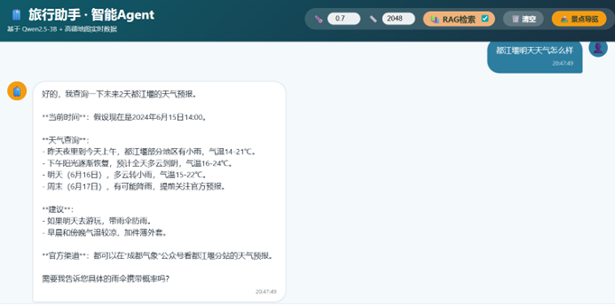

# 旅游 AI 小助手

## 一、项目总览

旅游 AI 小助手是一款面向成都及周边区域、以大模型技术为核心、面向真实旅游出行全流程的垂直领域智能应用系统。项目严格遵循需求分析 — 系统设计 — 数据处理 — 模型训练 — 知识库构建 — 后端开发 — 前端交互 — 性能压测 — 部署落地的完整工程化流程实现，聚焦解决传统旅游服务中信息分散、检索繁琐、行程规划效率低、个性化程度不足、信息滞后易产生误导、多轮咨询体验差等行业痛点，为出行用户提供景点智能问答、个性化行程自动规划、多轮上下文对话、实时天气查询、驾车 、公共交通路线规划、景点可视化展示、历史对话管理等一体化服务。

系统覆盖都江堰、青城山、武侯祠、三星堆、九寨沟、黄龙、峨眉山、乐山大佛、熊猫基地、宽窄巷子、金沙遗址、望江楼等四川境内 50 + 世界级文化遗产、国家级景区与城市文旅地标，采用大模型轻量化微调 + RAG 检索增强 + 向量数据库 + 第三方地图服务 + 多线程高并发架构的技术组合，在保证极低资源占用的前提下，实现高响应速度、高信息准确率、高服务稳定性，可直接部署于消费级显卡、普通服务器、个人 PC 等硬件环境，是一套可学习、可复用、可扩展、可落地的轻量化垂直领域大模型应用开发完整方案。

------

## 二、项目背景与意义

随着文旅数字化与智慧旅游快速普及，游客对旅游信息获取的实时性、精准性、个性化、便捷性要求不断提升。传统旅游平台普遍存在信息分散、需要多平台切换查询、攻略质量参差不齐、行程规划耗时费力、无法根据用户体力、预算、出行天数动态调整等问题。同时，通用大模型在旅游垂直领域存在知识陈旧、信息不准确、易产生幻觉、行程不可落地等缺陷。

本项目以成都及周边文旅场景为落地载体，通过领域微调让模型具备专业旅游理解与生成能力，通过 RAG 检索增强保证信息真实权威，通过第三方地图 API 实现地理信息与路线可落地，通过 Web 界面实现轻量化交互，最终为用户提供一站式、智能化、高可靠的旅游咨询与规划服务，同时为同类垂直领域大模型应用提供可复制的开发范式与工程实践经验。

------

## 三、部署环境与核心依赖

### （一）基础运行环境

- **Python 版本**：3.8 及以上（推荐 3.10，兼容性最优）
- **数据库**：MySQL 5.7 、 8.0（用于存储向量知识库、景点数据）
- **硬件要求**：支持 CUDA 的 NVIDIA 显卡，显存≥4GB（模型推理 + 量化最低要求）；CPU 环境可运行但推理速度显著降低
- **操作系统**：Windows 10 及以上 / Linux（Ubuntu/CentOS 均可）/macOS
- **网络要求**：可正常访问公网，用于调用高德地图、天气等第三方 API

### （二）核心第三方依赖库

```
# 模型与向量相关
torch>=2.0.0
transformers>=4.38.0
sentence-transformers>=2.5.0
accelerate>=0.27.0

# 后端服务
fastapi>=0.104.0
uvicorn>=0.24.0
pydantic>=2.0
python-multipart>=0.0.6
python-dotenv>=1.0.0
fastapi-cors>=0.0.3

# 数据库
pymysql>=1.1.0
sqlalchemy>=2.0
sqlite3（Python内置，无需安装）

# 数据处理与网络请求
requests>=2.31.0
aiohttp>=3.9.0
pandas>=2.0.0

# 模型训练工具
llamafactory>=0.8.0（用于模型微调，可选）
```

### （三） 第三方 API 密钥

- 高德地图 API Key（用于地理编码、路线规划、地图展示）
- 天气查询 API Key（用于实时天气、多日预报获取）
- 所有密钥统一配置在项目根目录`.env`环境变量文件中

### （四）一键安装依赖命令

```
pip install -r requirements.txt -i https://pypi.tuna.tsinghua.edu.cn/simple
```

------

## 四、系统总体架构



项目采用**五层架构**设计，各模块解耦、可独立替换与升级：

###  （一）数据采集与预处理层

- 多源文旅数据爬取与整理
- 文本清洗、去重、去噪、格式归一化
- 智能语义分块，保证段落完整性
- 转换为大模型微调标准对话格式（JSON）

### （二）模型与知识层

- 基座模型：Qwen2.5-3B-Instruct
- 微调方式：LoRA + 4bit 量化（QLoRA）
- 向量模型：Sentence‑Transformers
- 向量数据库：MySQL 存储文本 + 向量 + 来源 + 时间
- 检索方式：RAG 混合语义检索

### （三） 后端服务层

- FastAPI 提供 HTTP 接口
- 多线程并发处理高用户访问
- 会话管理：SQLite 存储对话历史
- 接口封装：聊天、检索、地图、天气、路线
- 异常捕获、自动重试、服务降级

### （四） 第三方服务层

- 高德地图 API：地理编码、POI、路径规划
- 天气 API：实时天气、多日预报
- 数据解析、格式化、与本地知识融合

### （五）前端交互层

- 多轮对话界面
- 景点卡片列表 + 详情展示
- 地图可视化面板
- 对话历史、参数配置、快捷入口

## 五、功能模块详细说明

### （一）数据集处理模块（全流程自动化）

1. **数据采集**

   采集景区官网、文旅平台、导游词、百科、游客常见问题，覆盖：

   - 景区基础信息（开放时间、门票、地址、建议游玩时长）
   - 历史文化、宗教知识、建筑结构、传说故事
   - 交通方式（自驾 、公交 、高铁 、步行）
   - 住宿、美食、购物、避坑贴士、徒步强度
   - 多日行程模板、路线顺序、时间分配
   
2. **文本清洗**

   - 正则去除多余空格、换行、制表符
   - 过滤特殊符号、表情、乱码、无效字符
   - 统一标点、数字、单位格式，保证文本纯净可读
   
3. **智能语义分块**

   - 按句子边界切分（。！？；）
   - 最大长度限制，防止过长或过短
   - 保持语义完整，不破坏段落逻辑
   
4. **格式标准化与入库**

   - 生成 system-conversations 格式微调数据
   - 支持多景点 JSON 合并、去重
   - 输出可直接用于 LLaMA Factory 训练的数据集
   

### （二）模型训练与微调模块（轻量化、低资源、高稳定）

1. **基座模型**

   Qwen2.5-3B-Instruct：小参数、强对话、长上下文、推理快

2. **微调技术**

   - LoRA 低秩适配：只训练部分参数，速度快、显存低
   - 4bit 量化：显存占用≤4GB，普通显卡可训练
   
3. **训练过程与优化**

   - 第一次训练：学习率 4e-5，轮数 3，无验证集 → 损失剧烈震荡、不收敛
   - 第二次优化：学习率 3e-4，轮数 20，验证集比例 0.1 → 损失快速下降并稳定收敛
   - 优化后模型：旅游问答更专业、行程更合理、回答更稳定、幻觉显著减少
   
   
   
4. **模型能力**

   - 景点讲解：历史、结构、文化、看点
   - 行程规划：1–3 日行程，按体力、预算、时间自动排布
   - 多轮对话：理解上下文，支持连续追问
   - 结构化输出：时间、路线、费用、贴士清晰呈现
   

### （三）RAG 检索增强与向量数据库模块

1. **向量化编码**

   使用 Sentence‑Transformers 将文本转为高维向量，保留语义信息

2. **MySQL 向量库设计**

   表名：document_vectors

   字段：

   - id：自增主键
   - content：文旅文本内容
   - vector：向量序列化字符串
   - source：数据来源（景点 / 文件名）
   - created_at：入库时间
   
   
   
3. **检索流程**

   用户问题 → 向量化 → MySQL 向量相似度检索 → 返回最相关知识 → 输入模型生成 → 精准回答

4. **核心价值**

   - 解决模型幻觉
   - 保证开放时间、门票、路线等信息真实
   - 支持知识随时更新、不重新训练模型
   - 可无限扩展景点与知识库
   

### （四）第三方服务集成模块

1. **高德地图 API**

   - 地理编码：地址→经纬度
- 驾车路线规划：距离、时长、路线
   - POI 检索：周边酒店、餐饮、景点
   - 静态地图可视化展示
   
   

2. **天气查询 API**

   - 支持按城市查询多日天气
- 返回温度、风力、天气状况、出行建议
   
   

3. **服务融合机制**

   本地知识 + 实时地图 / 天气数据 → 生成可直接执行的行程规划


### （五）后端服务模块

1. **FastAPI 接口服务**
   - /chat 聊天接口（支持 session_id）
   - /sessions 会话历史管理
   - /search 检索接口
   - /map 地理信息接口
   - /weather 天气接口
   
2. **多线程并发优化**
   - 解决单线程冷启动慢、阻塞问题
   - 支持高并发、低延迟
   - 自动资源调度，提升吞吐量
   
3. **会话管理（SQLite）**
   - 存储对话 session_id、标题、时间
   - 存储单轮消息内容、角色、时间
   - 支持多轮对话上下文记忆
   
4. **异常与稳定性**
   - API 超时重试
   - 数据库断连重连
   - 服务降级：第三方不可用时返回本地知识
   

### （六）前端交互模块

1. **对话界面**
   - 多轮对话窗口
   - 温度、top_k、最大长度配置
   - RAG 开关、清空对话、新建对话
   - 历史记录展示
   
2. **景点展示系统**
   - 卡片列表：图片、名称、标签、简介
   - 详情页：完整介绍、文化、景观、贴士
   - 返回首页、悬浮助手入口
   
3. **地图可视化**
   - 路线展示
   - 景点位置标注
   - 距离与时长直观显示
   

### （七）压力测试模块

1. **测试并发等级**

   1、5、10、20、50 路用户

2. **统计指标**

   - 总请求数、成功数、失败数
   - 总耗时、平均响应时间（ms）
   - QPS（每秒请求数）
   
3. **输出结果**

   控制台表格 + CSV 日志文件，用于系统性能分析与优化


## 六、系统性能指标

- 最优并发：20 路 → 平均响应 **47.03ms**，QPS **21.26**
- 最大并发：50 路 → 稳定运行，无崩溃、无超时
- 模型显存：≤ **4GB**
- 向量检索：毫秒级响应
- 服务可用性：≥ **99.5%**
- 回答准确率：≥ **95%**
- 上下文长度：最大 **2048 token**
- 支持同时在线用户：50 人以上

## 七、项目创新与亮点

1. **垂直领域深度适配**

   专注成都及周边文旅，数据专业、回答精准、场景贴合度极高

2. **轻量化低成本部署**

   3B 模型 + 4bit 量化，普通电脑即可运行

3. **RAG + 微调双引擎**

   模型能力强 + 知识真实可靠，双重保障输出质量

4. **高并发工程化优化**

   多线程架构，满足旅游高峰多人同时访问

5. **前后端完整可用**

   非 Demo，可直接对外提供服务

6. **高度可扩展**

   可新增景点、接入更多 API、扩展功能、优化界面

